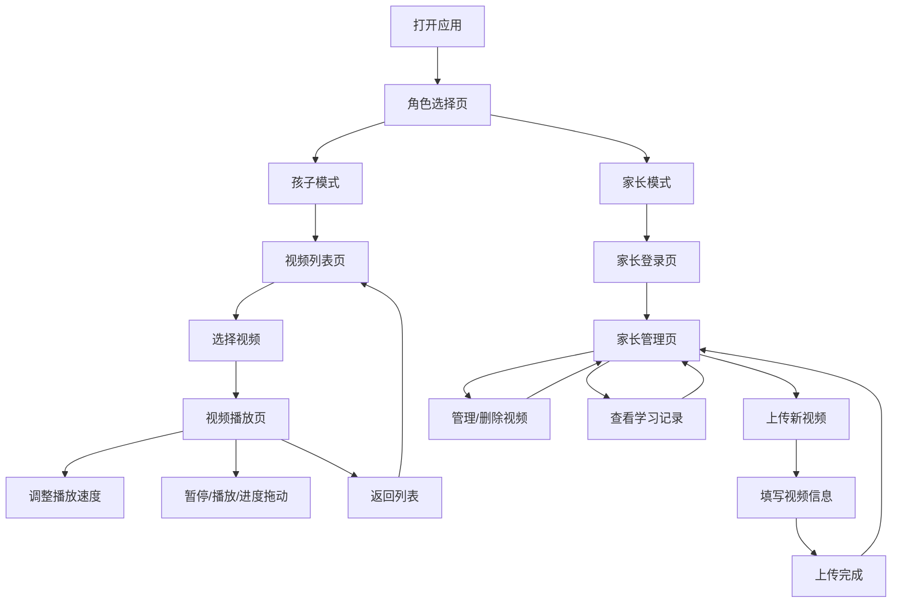

## 1. 产品概述

专为儿童设计的英语学习平台，解决老师通过微信发送视频无法重复播放、变速播放的痛点。家长和老师可以上传视频课程，孩子通过简单友好的界面自主学习，支持变速播放、学习进度记录等功能。

- 核心价值：让英语学习视频可重复听、可调速，操作简单适合儿童
- 目标用户：3-12岁学习英语的儿童、家长、老师
- 核心场景：家长/老师上传视频 → 孩子浏览并观看视频 → 可调节播放速度反复学习

## 2. 核心功能

### 2.1 用户角色

| 角色 | 登录方式 | 核心权限 |
|------|----------|----------|
| 孩子用户 | 无需密码，选择头像昵称进入 | 浏览视频列表、播放视频、调节播放速度、查看学习记录 |
| 家长/老师 | 密码登录 | 上传视频、管理视频分类、查看孩子学习进度、管理孩子账号 |

### 2.2 功能模块

1. **角色选择页**：选择进入"孩子模式"或"家长模式"
2. **孩子端 - 视频列表页**：课程分类、视频卡片展示、大图标易点击
3. **孩子端 - 视频播放页**：视频播放器、播放速度控制、播放/暂停、进度条
4. **孩子端 - 学习记录**：最近观看、学习时长统计
5. **家长端 - 登录页**：密码登录验证身份
6. **家长端 - 视频管理**：视频列表、上传视频、编辑/删除视频
7. **家长端 - 上传视频页**：视频文件上传、填写标题分类

### 2.3 页面详情

| 页面名称 | 模块名称 | 功能描述 |
|----------|----------|----------|
| 角色选择页 | 角色选择 | 大卡片选择：孩子模式 / 家长模式 |
| 孩子视频列表页 | 顶部欢迎区 | 孩子昵称、头像、欢迎语 |
| 孩子视频列表页 | 课程分类 | 按主题分类，大按钮易于点击 |
| 孩子视频列表页 | 视频卡片列表 | 视频封面、标题、时长，点击进入播放 |
| 孩子视频列表页 | 最近观看 | 展示最近看过的视频 |
| 视频播放页 | 视频播放器 | 全屏视频展示 |
| 视频播放页 | 播放控制栏 | 播放/暂停按钮、进度条、剩余时间 |
| 视频播放页 | 速度控制区 | 大按钮变速：0.5x / 0.75x / 1x / 1.25x / 1.5x / 2x |
| 视频播放页 | 返回按钮 | 明显的返回按钮，回到视频列表 |
| 家长登录页 | 登录表单 | 密码输入、登录按钮 |
| 家长管理页 | 视频管理列表 | 查看所有视频、编辑、删除 |
| 家长管理页 | 上传视频入口 | 点击进入上传页面 |
| 家长管理页 | 学习统计 | 查看孩子的学习数据 |
| 上传视频页 | 上传区域 | 拖拽或选择视频文件上传 |
| 上传视频页 | 视频信息 | 标题、分类、描述填写 |

## 3. 核心流程

## 4. 用户界面设计

### 4.1 设计风格

- **主色调**：温暖的橙色 + 天蓝色，活泼友好
- **辅助色**：薄荷绿、柠檬黄、樱花粉、薰衣草紫
- **按钮风格**：大圆角、立体阴影、点击有弹跳效果
- **字体**：圆润可爱的字体，大号字体易于阅读
- **布局风格**：卡片式布局，大间距，大图标
- **图标风格**：emoji 表情 + 圆润图标，童趣十足

### 4.2 页面设计概览

| 页面名称 | 模块名称 | UI元素 |
|----------|----------|--------|
| 角色选择页 | 角色卡片 | 两个大卡片，孩子卡片橙色系，家长卡片蓝色系，大图标 |
| 孩子视频列表页 | 顶部欢迎区 | 头像、昵称、欢迎语、星星装饰 |
| 孩子视频列表页 | 分类导航 | 横向滚动、彩色胶囊按钮、emoji图标 |
| 孩子视频列表页 | 视频卡片 | 圆角封面、大标题、时长标签、悬停放大效果 |
| 视频播放页 | 播放器区域 | 圆角视频框、阴影效果 |
| 视频播放页 | 控制栏 | 大按钮、圆形播放键、粗进度条 |
| 视频播放页 | 速度控制 | 6个大按钮横向排列、当前速度高亮放大 |
| 家长登录页 | 登录表单 | 简洁风格、密码输入、登录按钮 |
| 家长管理页 | 管理列表 | 表格布局、操作按钮 |
| 上传视频页 | 上传区域 | 虚线边框拖拽区、文件选择按钮、进度条 |

### 4.3 响应式设计

- 桌面端优先，自适应平板和手机
- 触控优化：按钮最小尺寸 48x48px，间距充足
- 横屏模式下视频占满宽度
- 孩子端界面更大更简洁，家长端信息密度更高

### 4.4 动效设计

- 页面切换：淡入淡出 + 轻微缩放
- 按钮点击：弹跳效果（scale 0.95 → 1.05 → 1）
- 视频卡片悬停：轻微上浮 + 阴影加深
- 速度切换：高亮色平滑过渡 + 缩放
- 上传进度：进度条平滑动画
