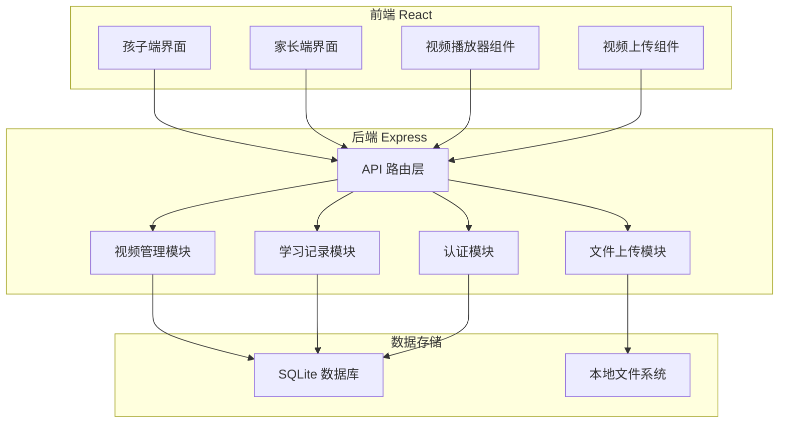

## 1. 架构设计



## 2. 技术描述

- **前端框架**：React 18 + TypeScript
- **构建工具**：Vite
- **样式方案**：Tailwind CSS 3
- **状态管理**：Zustand
- **路由方案**：React Router DOM
- **图标库**：Lucide React
- **视频播放**：原生 HTML5 Video API
- **后端框架**：Express 4 + TypeScript
- **数据库**：SQLite（文件型数据库，无需额外安装）
- **文件上传**：Multer
- **认证方式**：简单密码验证 + Session

## 3. 路由定义

### 3.1 前端路由

| 路由 | 页面 | 说明 |
|------|------|------|
| `/` | 角色选择页 | 选择孩子模式或家长模式 |
| `/kid` | 孩子视频列表页 | 孩子端首页，浏览视频 |
| `/kid/video/:id` | 视频播放页 | 播放视频，带速度控制 |
| `/parent/login` | 家长登录页 | 密码登录 |
| `/parent/dashboard` | 家长管理页 | 视频管理、学习统计 |
| `/parent/upload` | 上传视频页 | 上传新视频 |

### 3.2 后端 API 路由

| 方法 | 路由 | 说明 |
|------|------|------|
| GET | `/api/videos` | 获取视频列表 |
| GET | `/api/videos/:id` | 获取单个视频详情 |
| POST | `/api/videos` | 上传视频（带文件） |
| PUT | `/api/videos/:id` | 更新视频信息 |
| DELETE | `/api/videos/:id` | 删除视频 |
| GET | `/api/categories` | 获取分类列表 |
| POST | `/api/auth/login` | 家长登录 |
| POST | `/api/auth/logout` | 家长登出 |
| GET | `/api/auth/status` | 检查登录状态 |
| POST | `/api/records` | 记录学习进度 |
| GET | `/api/records` | 获取学习记录 |

## 4. 数据模型

### 4.1 视频表 (videos)

| 字段 | 类型 | 说明 |
|------|------|------|
| id | INTEGER PRIMARY KEY | 视频ID |
| title | VARCHAR(255) | 视频标题 |
| description | TEXT | 视频描述 |
| category | VARCHAR(100) | 分类 |
| duration | INTEGER | 时长（秒） |
| file_path | VARCHAR(500) | 视频文件路径 |
| thumbnail_path | VARCHAR(500) | 缩略图路径 |
| created_at | DATETIME | 创建时间 |
| updated_at | DATETIME | 更新时间 |

### 4.2 分类表 (categories)

| 字段 | 类型 | 说明 |
|------|------|------|
| id | INTEGER PRIMARY KEY | 分类ID |
| name | VARCHAR(100) | 分类名称 |
| icon | VARCHAR(50) | 图标（emoji） |
| color | VARCHAR(50) | 颜色 |
| sort_order | INTEGER | 排序 |

### 4.3 学习记录表 (study_records)

| 字段 | 类型 | 说明 |
|------|------|------|
| id | INTEGER PRIMARY KEY | 记录ID |
| video_id | INTEGER | 视频ID |
| child_name | VARCHAR(100) | 孩子名称 |
| watched_duration | INTEGER | 观看时长（秒） |
| playback_rate | FLOAT | 播放速度 |
| watched_at | DATETIME | 观看时间 |

### 4.4 设置表 (settings)

| 字段 | 类型 | 说明 |
|------|------|------|
| id | INTEGER PRIMARY KEY | 设置ID |
| parent_password | VARCHAR(255) | 家长密码（哈希） |
| child_name | VARCHAR(100) | 孩子昵称 |
| child_avatar | VARCHAR(100) | 孩子头像 |

## 5. 项目结构

```
├── src/                    # 前端源码
│   ├── components/         # 组件
│   │   ├── VideoPlayer.tsx    # 视频播放器
│   │   ├── SpeedControl.tsx   # 速度控制
│   │   ├── VideoCard.tsx      # 视频卡片
│   │   ├── CategoryNav.tsx    # 分类导航
│   │   └── BackButton.tsx     # 返回按钮
│   ├── pages/              # 页面
│   │   ├── RoleSelect.tsx     # 角色选择
│   │   ├── KidVideoList.tsx   # 孩子视频列表
│   │   ├── VideoPlay.tsx      # 视频播放
│   │   ├── ParentLogin.tsx    # 家长登录
│   │   ├── ParentDashboard.tsx # 家长管理
│   │   └── UploadVideo.tsx    # 上传视频
│   ├── store/              # 状态管理
│   │   └── usePlayerStore.ts
│   ├── types/              # 类型定义
│   ├── utils/              # 工具函数
│   ├── App.tsx
│   ├── main.tsx
│   └── index.css
├── api/                    # 后端源码
│   ├── routes/             # 路由
│   ├── controllers/        # 控制器
│   ├── services/           # 服务层
│   ├── db/                 # 数据库
│   ├── uploads/            # 上传文件目录
│   └── index.ts
├── shared/                 # 共享类型
├── package.json
├── tsconfig.json
├── vite.config.ts
└── tailwind.config.js
```

## 6. 功能实现要点

### 6.1 视频播放器
- 使用 HTML5 `<video>` 标签
- 自定义播放控制栏（隐藏原生控件）
- 支持播放/暂停、进度拖动
- 支持播放速度调节（0.5x - 2x）
- 支持全屏播放

### 6.2 速度控制
- 预设档位：0.5x, 0.75x, 1x, 1.25x, 1.5x, 2x
- 大按钮设计，易于点击
- 当前速度高亮显示
- 点击切换，带过渡动画

### 6.3 视频上传
- 支持拖拽上传和点击选择文件
- 显示上传进度
- 支持常见视频格式（mp4, webm, mov 等）
- 上传后自动获取视频时长
- 可填写标题、分类、描述

### 6.4 儿童友好交互
- 大按钮、大图标、大字体
- 鲜明的色彩对比
- 简单直观的操作
- 减少文字，多用图标和表情
- 点击反馈动画明显
